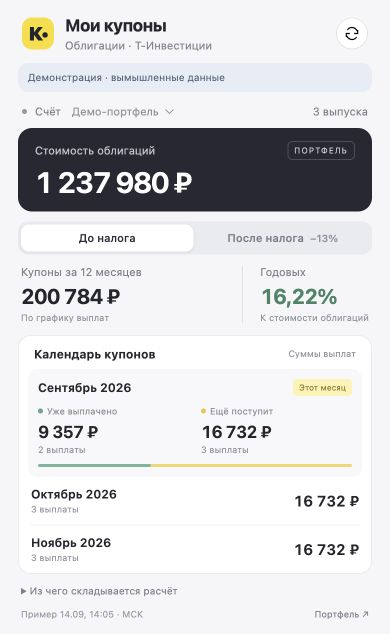

# Мои купоны — расширение Google Chrome

Небольшое окно по нажатию на значок расширения. Читает сайт Т‑Инвестиций в том профиле Chrome, где выполнен вход. API-токен не нужен.

## Установка

1. Откройте в Chrome `chrome://extensions`.
2. Включите **Режим разработчика** справа вверху.
3. Нажмите **Загрузить распакованное расширение** и выберите папку **extension** из этого проекта. Если скачали ZIP, сначала распакуйте его и выберите папку **extension** внутри.
4. Через значок пазла Chrome закрепите **Купоны · Т‑Инвестиции**.
5. В этом же профиле Chrome войдите на сайт Т‑Инвестиций и откройте **Портфель → нужный счёт → Обзор**. Вход во встроенном браузере Codex не переносит сессию в Chrome.
6. Нажмите значок расширения. Первый сбор начнётся автоматически. Дальше кнопка ↻ обновляет данные; при открытии окна данные старше 15 минут обновляются автоматически.

Расширение открывает одну неактивную служебную вкладку, последовательно читает страницы и закрывает её. Пока идёт сбор, оставьте исходную вкладку на сайте Т‑Инвестиций. Окно расширения можно закрывать. При смене счёта выберите его в окне и нажмите обновление.

## Что показывает

| Показатель | Источник и расчёт |
| --- | --- |
| Стоимость облигаций | Сумма столбца **Стоимость** только в строках облигаций на странице конкретного портфеля. Суммы берутся как показаны на сайте, включая учтённый сайтом НКД. Акции, фонды и остатки валюты не входят. |
| Купоны за 12 месяцев | Все известные выплаты от сегодняшнего дня до той же даты следующего года, не включая последнюю дату. Купон на одну бумагу × текущее количество бумаг. Выплата за сегодня, уже найденная в событиях, исключается из будущих. |
| Процент годовых | Купонный доход за указанные 12 месяцев / текущая стоимость облигаций × 100%. Это купонная доходность; изменение цены, погашение номинала и реинвестирование не учитываются. |
| Уже выплачено в этом месяце | Записи **Выплата купонов** и **Выплата купонов на карту** в **Событиях** выбранного счёта. Включает выплаты по уже проданным облигациям. |
| Ещё поступит в этом месяце | Будущие даты в графиках **Купоны**, умноженные на текущее количество бумаг. |
| Следующие два месяца | Те же графики, сгруппированные по календарным месяцам с русскими названиями и годом. |

Переключатель **После налога −13%** умножает доход и купонные суммы на 0,87. Стоимость облигаций не меняется. Расчёт использует единую выбранную ставку 13% и не воспроизводит индивидуальное удержание налога банком, льготы или взаимозачёты. Рубли считаются в копейках, налог округляется на итогах.

Календарные границы и время обновления — **Москва**. Прогноз предполагает неизменное количество бумаг. Фактические даты зачислений могут отличаться от графика. Купоны с уже прошедшими датами учитываются в полученном доходе только после появления записи в «Событиях». Право на выплату после покупки или продажи около даты фиксации владельцев отдельно не моделируется.

## Если часть данных недоступна

- Расширение раскрывает **«Ещё … будущих выплат»** для полного годового календаря и читает события до границы предыдущего месяца.
- Если таблица не загрузилась, изменилась или размер будущего купона неизвестен, выводится предупреждение. **≥** означает известную часть суммы. **—** означает, что сумма пока не определена.
- Если список событий закончился до того, как можно подтвердить полный охват месяца, сумма помечается неполной. Отсутствие прочитанных строк не приравнивается к подтверждённому нулю.
- Для портфеля на сайте выберите отображение стоимости **в рублях**. Купоны в других валютах показываются отдельно; без курса нельзя корректно складывать валюты и выводить общую рублёвую доходность.
- При ошибке входа авторизуйтесь на сайте в Chrome. При ошибке периода откройте **События** и задайте диапазон, включающий весь текущий месяц до сегодня.
- Если сайт поменяет разметку таблиц, потребуется обновить `extractor.js` и `collector.js`.

## Данные и разрешения

Расширение не читает пароли, cookies, токены или внутреннее состояние приложения. Собранные данные не отправляются на сторонний сервер. Сайт сам загружает свои страницы обычным способом.

- `scripting` — прочитать таблицы и раскрыть календарь в созданной расширением вкладке.
- `storage` — настройки и результаты сбора.
- Доступ к `https://www.tbank.ru/*` — Chrome выдаёт разрешение на весь хост; код ограничен страницами `/invest/portfolio/…` и `/invest/bonds/…/coupons/`.

Снимок портфеля и события хранятся только в `chrome.storage.session`: до закрытия браузера, перезагрузки или отключения расширения. Настройка налога и адрес последнего выбранного счёта сохраняются локально. Синхронизации с Google нет. Кнопка **«Удалить собранные данные»** удаляет снимок и адрес счёта.

## Проверка и разработка

Расширение написано на JavaScript без сборки и внешних библиотек времени исполнения. `linkedom` используется только для тестов, в ZIP не входит.

```sh
npm ci
npm test
npm run preview
npm run package
```

Предпросмотр: `http://127.0.0.1:8765/extension/popup.html`. В обычной вкладке он показывает только явно помеченные вымышленные данные; их нельзя перепутать с собранным портфелем. Сам сбор доступен лишь в установленном расширении.

Проверены 19 сценариев: разбор широких и узких таблиц, разделение фондов и облигаций, количество бумаг, русские числа и даты, переход года, налог, проданные облигации в истории, пропуски в календаре, отдельные валюты, раскрытие будущих выплат, фильтр событий и жизненный цикл служебной вкладки. Структура источников дополнительно проверена на авторизованном сайте. Интерфейс и переключатель налога проверены в браузере. Полный сбор установленным расширением в пользовательском профиле Chrome ещё не выполнялся.

Технические справочники: [окно расширения Chrome](https://developer.chrome.com/docs/extensions/develop/ui/add-popup), [разрешения на внедрение кода](https://developer.chrome.com/docs/extensions/reference/api/scripting), [хранилище расширений](https://developer.chrome.com/docs/extensions/reference/api/storage). Расширение не является официальным продуктом Т‑Банка.
